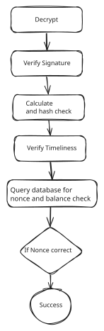

# Security Module

This module is the first interface that the request passes through and is repsonsible for the security of the ledger.

## Functionalities
1. Verify the signature of a transaction using the public key of the sender 
2. Verify the integrity of a transaction via hashing 
3. Verify the timeliness of a trasaction (timestamp) 
4. Verify the Nonce of a transaction to prevent replay attacks

## Logic

The module receives the transaction and performs the following

1. Use AES-256 to make sure that the transaction was meant to me by decrypting it via the public key of the central bank **non-repudiation**. (Threat 1)
2. Use SHA-256 to make sure that the transaction is not modified or tampered with and this ensures **data integrity**. (Threat 2)
3. Verify that the timestamp is within a certain range of the current time to prevent **time-based attacks**. (Threat 3)
4. Make a database call to check that the nonce has not been used before to prevent **replay attacks**. (Threat 4)

## diagram

