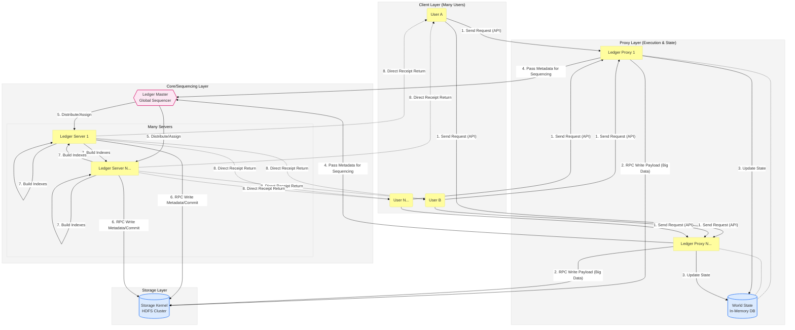

```mermaid
%%{init: {'theme': 'base', 'themeVariables': { 'primaryColor': '#fffd9e', 'edgeLabelBackground':'#ffffff', 'tertiaryColor': '#f4f4f4'}}}%%
flowchart TD
    %% Define Groups for visual structure
    subgraph Clients ["Client Layer (Many Users)"]
        U1(User A)
        U2(User B)
        Un(User N...)
    end

    subgraph Proxies ["Proxy Layer (Execution & State)"]
        LP1[Ledger Proxy 1]
        LP2[Ledger Proxy N...]
        WS[(World State\nIn-Memory DB)]
        %% Couple WS tightly with proxies
        LP1 -.- WS
        LP2 -.- WS
    end

    subgraph Storage ["Storage Layer"]
        HDFS[(Storage Kernel\nHDFS Cluster)]
    end

    subgraph Core ["Core/Sequencing Layer"]
        LM{{Ledger Master\nGlobal Sequencer}}
        subgraph Servers ["Many Servers"]
           LS1[Ledger Server 1]
           LS2[Ledger Server N...]
        end
    end

    %% ---- THE FLOW ----

    %% 1. Clients send to many Proxies
    U1 & U2 & Un -- "1. Send Request (API)" --> LP1 & LP2

    %% 2. Proxy writes payload to HDFS via RPC
    LP1 & LP2 -- "2. RPC Write Payload (Big Data)" --> HDFS

    %% 3. Proxy updates World State
    LP1 & LP2 -- "3. Update State" --> WS

    %% 4. Passes to Master for Sequencing/Distribution
    LP1 & LP2 -- "4. Pass Metadata for Sequencing" --> LM

    %% 5. Master distributes to appropriate Server
    LM -- "5. Distribute/Assign" --> LS1 & LS2

    %% 6. Servers write metadata to HDFS
    LS1 & LS2 -- "6. RPC Write Metadata/Commit" --> HDFS

    %% 7. Servers build indexes (internal action)
    LS1 & LS2 -- "7. Build Indexes" --> LS1 & LS2

    %% 8. DIRECT RETURN of receipt to original client
    %% Using dotted line to emphasize direct, async return path bypassing proxies/master
    LS1 & LS2 -. "8. Direct Receipt Return" .-> U1 & U2 & Un

    %% Styling for emphasis
    classDef storage fill:#dbeafe,stroke:#3b82f6,stroke-width:2px;
    class HDFS,WS storage;
    classDef master fill:#fce7f3,stroke:#db2777,stroke-width:2px,shape:hexagon;
    class LM master;
```